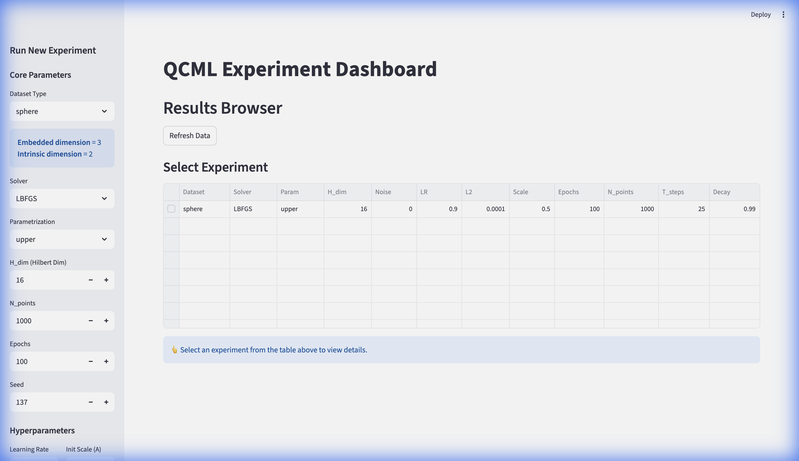
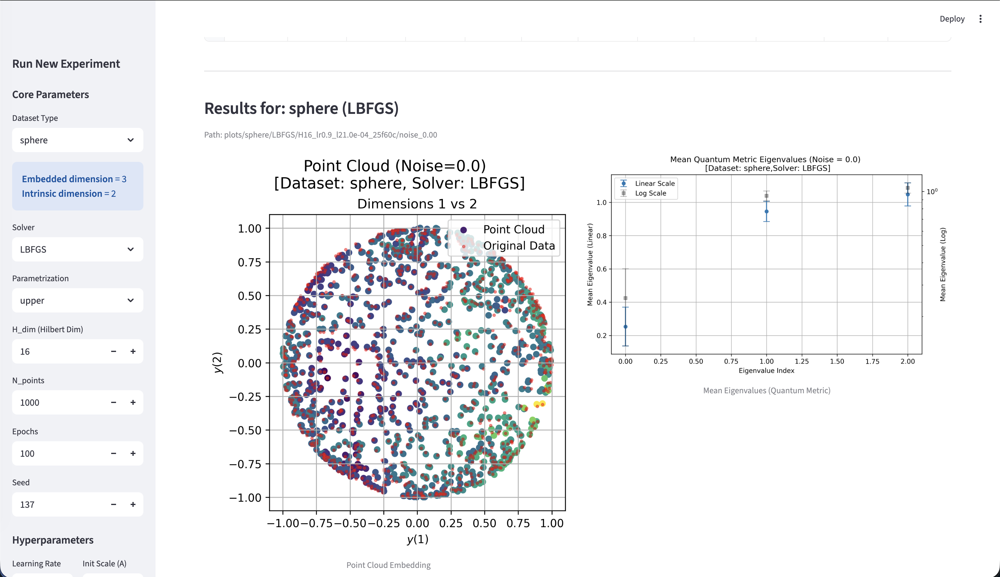

# QCML: Quantum Cognition Machine Learning


## Overview

Intrinsic dimension estimator using quantum geometric methods. Maps data points to ground states of error Hamiltonians and extracts dimension from the eigenvalue spectrum of the quantum metric tensor.

Built using JAX (natively supports GPU/TPU acceleration).

> [!NOTE]
> For Apple Silicon GPU acceleration, install `jax-metal`: `uv pip install jax-metal`

Open-source reproduction of methods from:
> [A quantum cognition approach to intrinsic dimension estimation](https://www.nature.com/articles/s41598-025-91676-8) (Scientific Reports, 2025)

Technical documentation: **[DOCUMENTATION.md](DOCUMENTATION.md)**

## Implementation

**Optimization Methods:**
- `analytic`: Full analytic gradient via eigenvalue perturbation theory
- `jaxopt`: L-BFGS quasi-Newton solver
- `optax`: Adam optimizer with exponential decay scheduling
- `pseudo`: Pseudo-gradient heuristic (first-order approximation)

**Matrix Parametrizations:**
- `upper`: Upper triangular + diagonal (Cholesky-like for Hermitian matrices)
- `pauli`: Expansion in generalized Pauli basis

**Datasets:**
- Hypersphere manifolds (`sphere`, `sphere_other`)
- Hypercube boundaries (`cubic`, `cubic_other`)
- Campadelli benchmark manifolds (`campadelli_beta`, `campadelli_n`)

## Method

Given $N$ points $x \in \mathbb{R}^E$, learn Hermitian matrices $A_\mu$ (for $\mu=1 \dots E$) of dimension $H \times H$ by minimizing reconstruction error.

**Error Hamiltonian** for each point:

$$ H_E(x) = \frac{1}{2}\sum_{\mu=1}^E (A_\mu - x_\mu I)^2 $$

Ground state $|\psi_0(x)\rangle$ satisfies $H_E(x)|\psi_0(x)\rangle = E_0|\psi_0(x)\rangle$.

Reconstruction: $y_\mu = \langle \psi_0 | A_\mu | \psi_0 \rangle$

Loss: $L = \sum_i ||y^{(i)} - x^{(i)}||^2$

**Quantum metric** from excited states:

$$ g_{\mu\nu} = 2 \text{Re} \sum_{n \geq 1} \frac{\langle \psi_0 | A_\mu | \psi_n \rangle \langle \psi_n | A_\nu | \psi_0 \rangle}{E_n - E_0} $$

Intrinsic dimension estimated from spectrum of $g$ by identifying the spectral gap where eigenvalues drop from $O(1)$ to $O(\epsilon)$.

Analytic gradient derivation: `gradient.pdf`

## Quick Start

1. **Clone the repository:**
```bash
git clone https://github.com/GeetRakala/QCML.git
cd QCML
```

2. **Install uv** (if not already installed):
```bash
curl -LsSf https://astral.sh/uv/install.sh | sh
```

3. **Initialize dependencies:**
```bash
uv sync
```

4. **Launch the dashboard:**
```bash
uv run streamlit run dashboard.py
```

The dashboard will open in your browser. First launch will take a few minutes while dependencies are compiled.

## Usage

### Dashboard

Interactive Streamlit interface for running and visualizing experiments:

<p float="left">
  
   
</p>

Features:
- Sortable experiment results table
- Experiment management (view configs, delete runs)
- Launch new runs with sidebar parameter controls

```bash
uv run streamlit run dashboard.py
```

### Command Line

Run experiments from `config/default_config.yaml`:

```bash
uv run main.py
```

### Library Import

Use in Jupyter notebooks:

```python
import jax
import yaml
from main import run_experiment

# Load base config
with open("config/default_config.yaml", "r") as f:
    config = yaml.safe_load(f)["experiment"]

# Override params
config["solver"] = "jaxopt"
config["dataset_type"] = "sphere"
config["epochs"] = 1000

# Run
run_experiment(config, noise_level=0.01, seed=42)
```

Results saved to `plots/` with hierarchical structure. Each run gets a unique directory based on configuration hash.

## Files

- `src/`: Source code
  - `data.py`: Synthetic dataset generators
  - `models.py`: Parametrizations and quantum metric logic
  - `loss.py`: Loss functions
  - `training.py`: Training loops
  - `plotting.py`: Visualization
- `config/`: Configuration files (`default_config.yaml`)
- `main.py`: Main entry point
- `dashboard.py`: Streamlit experiment dashboard
- `DOCUMENTATION.md`: Detailed API and logic documentation
- `plots.pdf`: Benchmark results (contains sample experiments)
- `gradient.pdf`: Analytic gradient derivation

## References

1. **Scientific Reports** (2025). *A quantum cognition approach to intrinsic dimension estimation*. [https://www.nature.com/articles/s41598-025-91676-8](https://www.nature.com/articles/s41598-025-91676-8)
2. **Qognitive AI**: [https://www.qognitiveai.com/](https://www.qognitiveai.com/)

## License

MIT License

## Author

**Geet Rakala**